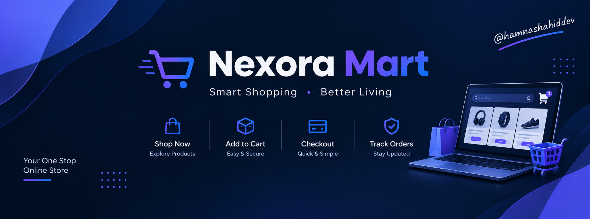
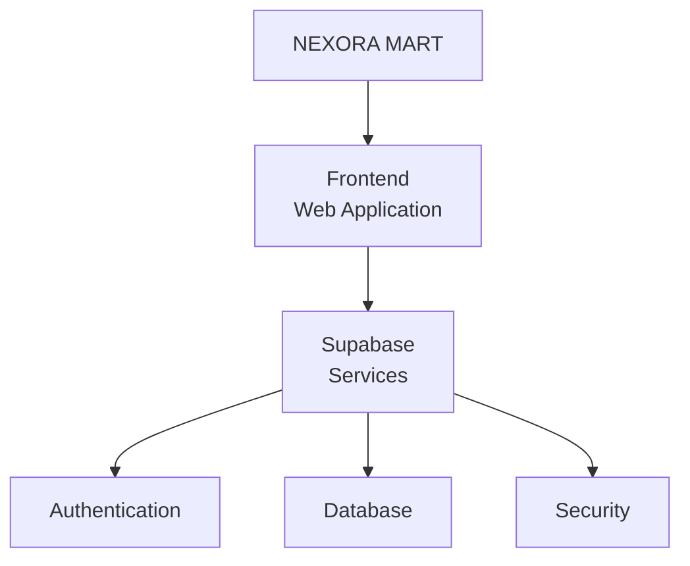
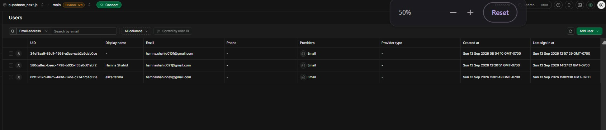
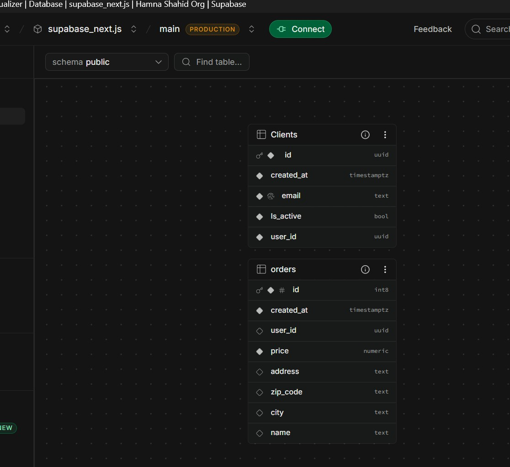
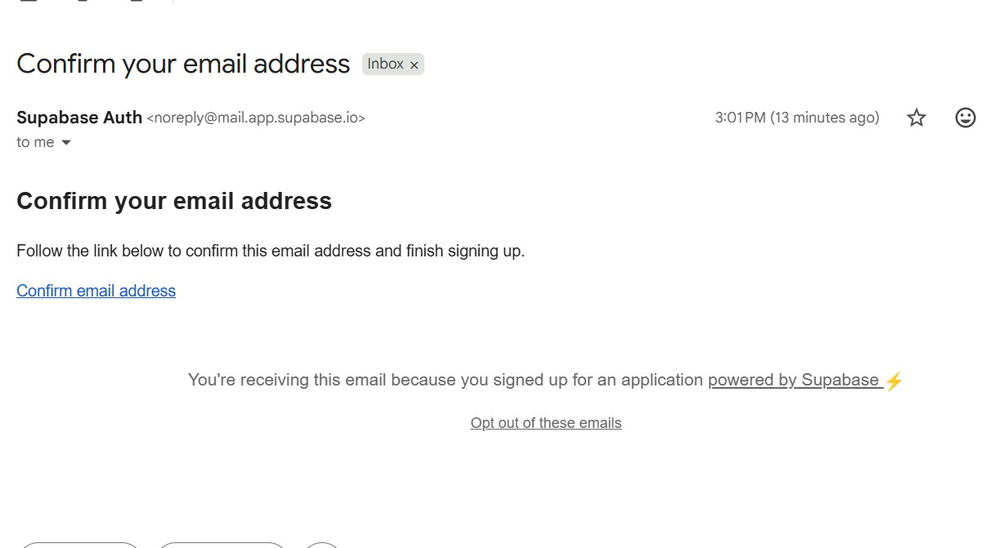
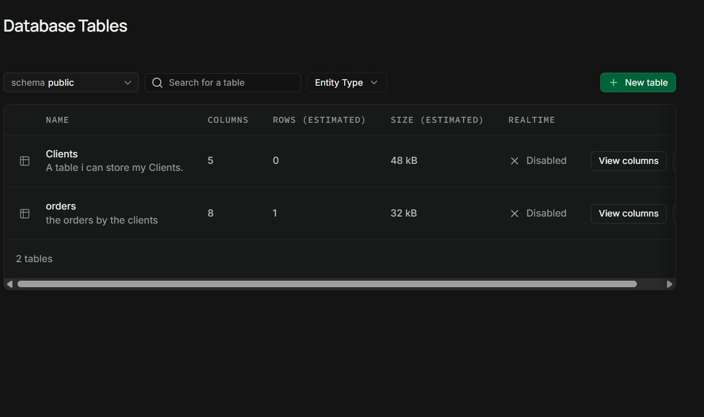
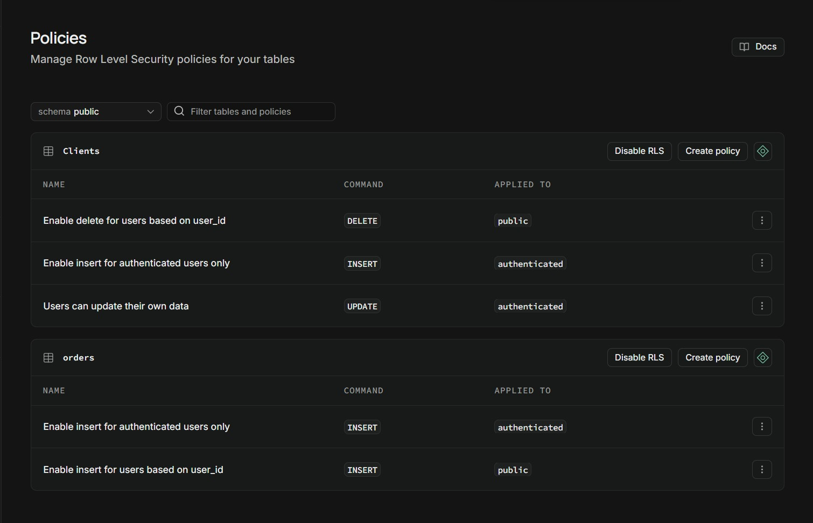

# 🛒 Nexora Mart — Supabase

### A Modern E-Commerce Application with Supabase-Powered Authentication, Database & Secure Backend

<p align="center">
  
</p>

<p align="center">
  <strong>A modern e-commerce project built with a Vite-based frontend and Supabase backend services.</strong>
</p>

<p align="center">


</p>

---

# 📋 Table of Contents

- [🚀 Introduction](#-introduction)
- [🎯 Project Objective](#-project-objective)
- [❗ Problem Statement](#-problem-statement)
- [💡 Solution](#-solution)
- [🔎 Project Overview](#-project-overview)
- [✨ Features](#-features)
- [🔐 Authentication](#-authentication)
- [🗄️ Database](#️-database)
- [⚙️ Application Structure](#️-application-structure)
- [🛠️ Technology Stack](#️-technology-stack)
- [📂 Repository Structure](#-repository-structure)
- [📄 File Overview](#-file-overview)
- [⚙️ Installation](#️-installation)
- [🔑 Environment Variables](#-environment-variables)
- [▶️ Running the Project](#️-running-the-project)
- [🧪 Testing](#-testing)
- [🔒 Security](#-security)
- [🚧 Current Limitations](#-current-limitations)
- [🚀 Future Improvements](#-future-improvements)
- [🤝 Contributing](#-contributing)
- [❓ Troubleshooting](#-troubleshooting)
- [👩‍💻 Author](#-author)
- [📜 License](#-license)
- [⭐ Support](#-support)

---

# 🚀 Introduction

**Nexora Mart — Supabase** is a modern e-commerce application designed around a Supabase-powered backend.

The project combines a modern frontend development environment with **Supabase services** to provide the foundation for authentication, database management, and secure application data handling.

The project is organized to keep the frontend application, Supabase configuration, environment configuration, and supporting project resources clearly separated.

Nexora Mart is designed as a practical project for building and understanding a modern full-stack application using **Supabase as the backend platform**.

---

# 🎯 Project Objective

The primary objective of Nexora Mart is to build a modern e-commerce application while learning and implementing backend functionality with Supabase.

The project focuses on:

- 🔐 User authentication
- 👤 User account management
- 🗄️ Database integration
- 🔒 Secure data access
- ⚡ Modern frontend development
- 🔗 Frontend-to-backend communication
- 🌐 Environment-based configuration
- 📦 Structured application development
- 🛒 E-commerce application concepts

The project also provides practical experience with integrating a frontend application with a cloud-based backend service.

---

# ❗ Problem Statement

Modern web applications require more than just a frontend interface.

An application may need:

- User registration
- User login
- User sessions
- Database storage
- Secure access to application data
- Environment configuration
- Backend services
- Scalable application architecture

Building all of these services completely from scratch can require significant development time and backend infrastructure.

Nexora Mart addresses this challenge by using **Supabase** as the backend platform while maintaining a structured frontend application.

---

# 💡 Solution

Nexora Mart uses Supabase to provide backend functionality for the application.

The overall concept is:





The frontend communicates with Supabase to handle application-related backend operations.

---

# 🔎 Project Overview

**Nexora Mart — Supabase** is structured as a frontend application connected to Supabase.

The repository contains dedicated areas for:

* Frontend source code
* Supabase configuration
* Environment configuration
* Static project assets
* Documentation
* Database-related resources
* Application configuration

The project is intended to provide a clean foundation for expanding the application into a complete e-commerce platform.


---

# ✨ Features

## 🔐 Authentication

The project includes a foundation for user authentication using Supabase.

Authentication-related functionality can include:

* User registration
* User login
* User sessions
* Secure authentication
* User account handling
* Authentication state management




---

## 🗄️ Supabase Database

Supabase provides the backend database layer for the application.

The project contains a dedicated:

```text
supabase/
```

directory for Supabase-related resources and configuration.

This keeps backend-related functionality organized separately from the main frontend source code.




---

## 🛒 E-Commerce Foundation

Nexora Mart is designed around an e-commerce application concept.

The project can be expanded with functionality such as:

* Product management
* Product browsing
* Product categories
* Shopping cart
* User accounts
* Orders
* Customer data
* Secure database operations

---

## 🌐 Environment Configuration

The repository includes environment configuration files:

```text
.env
.env.example
```

Environment variables allow configuration values and credentials to remain separate from application source code.

---

## 📚 Documentation

The project also contains learning and documentation resources:

```text
README.md
SUPABASE_LEARNING.md
```

These resources help document the project and Supabase-related development concepts.

---

# 🔐 Authentication

Authentication is an important part of Nexora Mart.

The application uses Supabase as the authentication backend.

A typical authentication flow is:

```text
User
 │
 ├── Sign Up
 │
 ▼
Supabase Authentication
 │
 ├── Create Account
 │
 ▼
Authenticated User
 │
 ├── Login
 │
 ▼
Application
```

The frontend can communicate with Supabase to manage authentication state.

Authentication-related UI and resources are represented in the project through:

```text
authentication.jpg
email.jpg
```
## 📧 Email Authentication



---

# 🗄️ Database

The project includes Supabase database resources inside:

```text
supabase/
```

Database-related documentation and visual resources are also included in the repository.

For example:

```text
database.jpg
tables.jpg
policies.jpg
```

These resources document the database structure and security concepts used within the project.
## 📊 Database Tables


---

# 🛡️ Row Level Security

Supabase applications can use **Row Level Security (RLS)** to control which users can access specific database records.

The project includes a dedicated visual resource:

```text
policies.jpg

```

for documenting database policy concepts.

RLS is especially important in applications where users should only be allowed to access authorized data.

## 🛡️ Security Policies



---

# ⚙️ Application Structure

The project follows a straightforward frontend/backend structure:

```text
User
  │
  ▼
Frontend Application
  │
  ▼
Supabase Client
  │
  ├── Authentication
  │
  ├── Database
  │
  └── Security Policies
```

This architecture keeps the frontend application separate from Supabase backend services while allowing them to communicate through the Supabase client.

---

# 🛠️ Technology Stack

| Technology                 | Purpose                                |
| -------------------------- | -------------------------------------- |
| ⚡ **Vite**                 | Frontend development and build tooling |
| 🟢 **Supabase**            | Backend platform                       |
| 🔐 **Supabase Auth**       | User authentication                    |
| 🗄️ **Supabase Database**  | Application data storage               |
| 🛡️ **Row Level Security** | Database access control                |
| 📦 **Node.js / npm**       | Dependency management                  |
| 🌐 **HTML**                | Application structure                  |
| 💻 **JavaScript**          | Application logic                      |

> The exact frontend libraries and dependencies are defined in `package.json`.

---

# 📂 Repository Structure

```text
nexora-mart-supabase/
│
├── 📁 node_modules/
│
├── 📁 scratch/
│
├── 📁 src/
│   └── Application source code
│
├── 📁 supabase/
│   └── Supabase-related resources
│
├── 🔐 .env
├── 📄 .env.example
│
├── 🖼️ authentication.jpg
├── 🖼️ banner.png
├── 🖼️ database.jpg
├── 🖼️ email.jpg
├── 🖼️ policies.jpg
├── 🖼️ tables.jpg
│
├── 🌐 index.html
├── 📜 LICENSE
├── 📦 package.json
├── 🔒 package-lock.json
│
├── 📖 README.md
├── 📚 SUPABASE_LEARNING.md
│
└── ⚡ vite.config.js
```

---

# 📄 File Overview

| File / Directory       | Purpose                                      |
| ---------------------- | -------------------------------------------- |
| `src/`                 | Main application source code                 |
| `supabase/`            | Supabase-related configuration and resources |
| `.env`                 | Local environment configuration              |
| `.env.example`         | Example environment configuration            |
| `authentication.jpg`   | Authentication-related project visual        |
| `banner.png`           | Project README banner                        |
| `database.jpg`         | Database-related visual                      |
| `email.jpg`            | Email/authentication-related visual          |
| `policies.jpg`         | Database policies/RLS visual                 |
| `tables.jpg`           | Database table visual                        |
| `index.html`           | Main HTML entry point                        |
| `package.json`         | Project dependencies and scripts             |
| `package-lock.json`    | Locked dependency versions                   |
| `vite.config.js`       | Vite configuration                           |
| `SUPABASE_LEARNING.md` | Supabase learning/documentation notes        |
| `README.md`            | Main project documentation                   |
| `LICENSE`              | Project license                              |

---

# ⚙️ Installation

## Prerequisites

Before running the project, make sure you have:

* Node.js installed
* npm installed
* Git installed
* A Supabase account
* A code editor such as Visual Studio Code

---

## 1. Clone the Repository

```bash
git clone https://github.com/hamnashahiddev/nexora-mart-supabase.git
```

---

## 2. Navigate to the Project

```bash
cd nexora-mart-supabase
```

---

## 3. Install Dependencies

```bash
npm install
```

This installs the dependencies defined in:

```text
package.json
```

---

# 🔑 Environment Variables

The project contains:

```text
.env
.env.example
```

Create your local `.env` file based on `.env.example`.

Example:

```env
YOUR_SUPABASE_VARIABLE=your_value
```

> Do not commit private Supabase credentials or sensitive environment variables to a public repository.

Your actual environment variable names should match those used by the application.

---

# ▶️ Running the Project

Start the development server with:

```bash
npm run dev
```

Vite will start the development environment.

Open the local URL shown in your terminal.

---

# 🧪 Testing

After starting the application, test the main functionality of the project.

### Authentication Testing

Test:

```text
✓ Sign Up
✓ Login
✓ Logout
✓ Authentication state
✓ Invalid credentials
✓ Email-related authentication flow
```

### Database Testing

Verify that:

```text
✓ Database connection works
✓ Tables are accessible
✓ Authorized operations work
✓ Unauthorized operations are blocked
✓ Security policies behave as expected
```

### UI Testing

Check:

```text
✓ Application loads correctly
✓ Navigation works
✓ Forms work correctly
✓ Authentication pages work
✓ No major console errors appear
```

---

# 🔒 Security

Security is an important part of any Supabase application.

## Environment Variables

Never expose private credentials directly inside source code.

Use:

```text
.env
```

for local environment configuration.

Use:

```text
.env.example
```

to document the required variables without exposing real credentials.

---

## Row Level Security

Database access should be protected using appropriate Supabase policies.

The project includes:

```text
policies.jpg
```

as documentation for the database policy/security layer.

Always ensure that users can only access the data they are authorized to access.

---

## ⚠️ Never Commit Secrets

Do not commit:

```text
API keys
Private credentials
Passwords
Access tokens
Service-role keys
Private environment values
```

to a public GitHub repository.

---

# 🚧 Current Limitations

The current project is a development foundation for a Supabase-powered e-commerce application.

Depending on the current implementation, additional functionality may still need to be developed, such as:

* Complete product management
* Complete shopping cart functionality
* Complete order management
* Payment integration
* Advanced product search
* Inventory management
* Admin dashboard
* Advanced analytics
* Production deployment configuration

These can be added as the project continues to evolve.

---

# 🚀 Future Improvements

Possible future improvements include:

* 🛒 Complete shopping cart system
* 📦 Product management
* 🏷️ Product categories
* 🔎 Product search and filtering
* ❤️ Wishlist functionality
* 👤 User profile management
* 📋 Order management
* 💳 Payment integration
* 📊 Admin dashboard
* 📦 Inventory management
* 📈 E-commerce analytics
* 📧 Email notifications
* 🛡️ Advanced security policies
* 📱 Improved responsive design
* 🌐 Production deployment
* ⚡ Performance optimization
* 🧪 Automated testing

---

# 🤝 Contributing

Contributions and suggestions are welcome.

If you would like to improve Nexora Mart:

1. Fork the repository.
2. Create a new branch:

```bash
git checkout -b feature/new-feature
```

3. Make your changes.
4. Test your changes locally.
5. Commit your changes:

```bash
git commit -m "Add new feature"
```

6. Push the branch:

```bash
git push origin feature/new-feature
```

7. Open a Pull Request.

---

# ❓ Troubleshooting

## Node.js Is Not Recognized

Check your Node.js installation:

```bash
node --version
```

Also check npm:

```bash
npm --version
```

If either command is not recognized, install Node.js and restart your terminal.

---

## Dependencies Are Missing

Run:

```bash
npm install
```

Then start the application again:

```bash
npm run dev
```

---

## Supabase Connection Problems

Check that:

* Your Supabase project is active.
* Your environment variables are correctly configured.
* The variable names match the application.
* Your Supabase URL is correct.
* Your Supabase public/anon key is correct.
* Your database policies allow the requested operation.

---

## Authentication Problems

If authentication does not work:

1. Check the Supabase authentication configuration.
2. Verify your environment variables.
3. Check the browser console.
4. Check the Supabase authentication logs.
5. Verify that the required authentication method is enabled.

---

# 📖 Documentation

The repository includes additional documentation:

### `SUPABASE_LEARNING.md`

Contains learning and reference material related to the Supabase concepts used during the development of the project.

The project also includes visual documentation:

```text
authentication.jpg
database.jpg
email.jpg
policies.jpg
tables.jpg
```

These visuals help document the different parts of the application's Supabase architecture.

---

# 👩‍💻 Author

## Hamna Shahid

**AI Automation Engineer | BS AI Student**

Passionate about:

* Artificial Intelligence
* AI Automation
* Intelligent Systems
* Workflow Automation
* AI Agents
* Modern Web Applications
* Practical Technology Solutions

### Connect With Me

**GitHub**

[https://github.com/hamnashahiddev](https://github.com/hamnashahiddev)

**LinkedIn**

[https://www.linkedin.com/in/hamnashahiddev/](https://www.linkedin.com/in/hamnashahiddev/)

---

# 📜 License

This project is licensed under the **MIT License**.

You are free to:

* ✅ Use the project
* ✅ Modify the source code
* ✅ Distribute the project
* ✅ Use it for learning
* ✅ Build upon the project

See the [`LICENSE`](LICENSE) file for complete license information.

---

# ⭐ Support

If you found this project useful or interesting, consider giving the repository a ⭐ on GitHub.

Your support is appreciated!

---

<p align="center">
